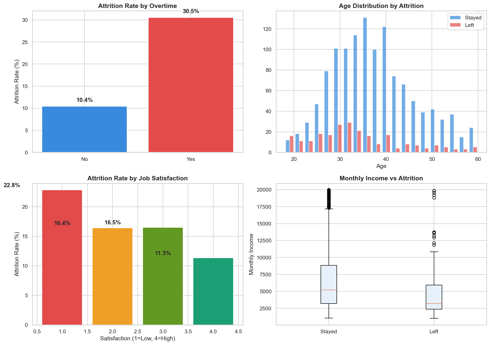
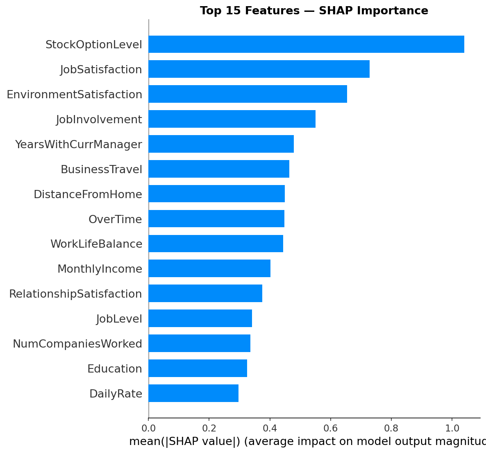
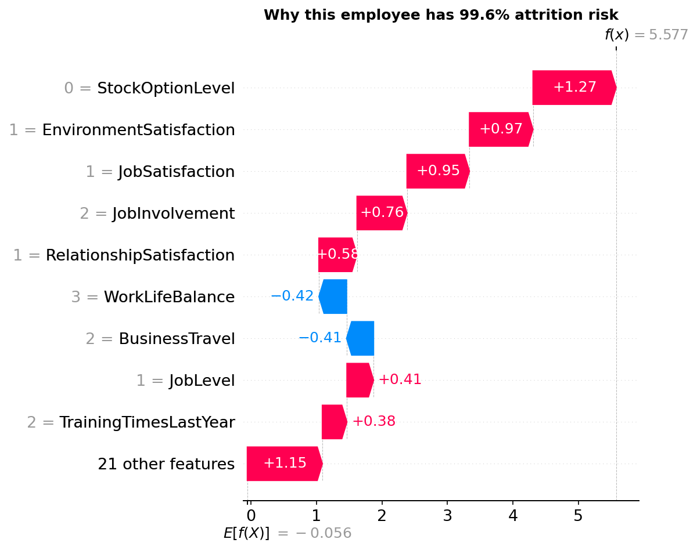
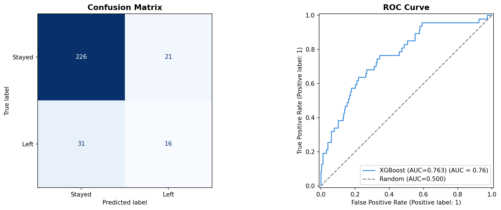

# Employee Attrition Predictor


A machine learning web app that predicts employee attrition risk using XGBoost
and explains each prediction using SHAP (SHapley Additive exPlanations).

**Live demo:** [Coming soon — Streamlit Cloud link here]

---

## What it does

HR managers enter an employee's profile in the sidebar and instantly get:
- Attrition risk score (0–100%)
- Top 5 factors driving the prediction
- SHAP waterfall chart explaining the exact contribution of each feature

---

## Key findings from EDA

- Overall attrition rate: **16.1%** (class imbalance problem)
- Overtime employees leave at **30.5%** vs **10.4%** for non-overtime
- Median tenure before leaving: **3 years** vs 6 years for employees who stay
- Low job satisfaction (score 1) attrition rate: **22.8%** vs 11.3% for score 4
- Employees who leave earn **$4,787/mo** average vs $6,833 for those who stay

---

## Model performance

| Metric | Score |
|---|---|
| AUC-ROC | 0.763 |
| Accuracy | 0.82 |
| Precision (Left) | 0.43 |
| Recall (Left) | 0.34 |
| Weighted F1 | 0.81 |

---

## Technical approach

- **Dataset:** IBM HR Analytics — 1,470 rows, 35 features (Kaggle)
- **Class imbalance:** 16.1% attrition — fixed with SMOTE oversampling
- **Model:** XGBoost with GridSearchCV (80 combinations, 5-fold CV)
- **Explainability:** SHAP TreeExplainer — global + per-prediction waterfall charts
- **Deployment:** Streamlit web app

---

## Project structure
```
ATTRITION-PREDICTOR/
├── data/
├── notebooks/
│   ├── 01_eda.ipynb
│   ├── 02_model.ipynb
│   └── 03_shap_analysis.ipynb
├── app.py
├── requirements.txt
├── requirements-dev.txt
└── README.md
```


---

## Setup

**1. Clone the repo**
```bash
git clone https://github.com/TejaswiDenaboina/employee-attrition-predictor.git
cd employee-attrition-predictor
```

**2. Create virtual environment**
```bash
python -m venv venv
venv\Scripts\activate        # Windows
source venv/bin/activate     # Mac/Linux
pip install -r requirements.txt
```

**3. Download the dataset**

Go to [Kaggle — IBM HR Analytics](https://www.kaggle.com/datasets/pavansubhasht/ibm-hr-analytics-attrition-dataset)
→ Download → extract → place `WA_Fn-UseC_-HR-Employee-Attrition.csv` in the `data/` folder
→ Rename to `HR-Employee-Attrition.csv`

**4. Train the model**

Run all cells in `notebooks/02_model.ipynb` — this generates `model.pkl` and `feature_names.pkl`

**5. Run the app**
```bash
streamlit run app.py
```

---

## Screenshots






---

## Tech stack

Python · XGBoost · Scikit-learn · SHAP · SMOTE · Streamlit · Pandas · Matplotlib · Seaborn